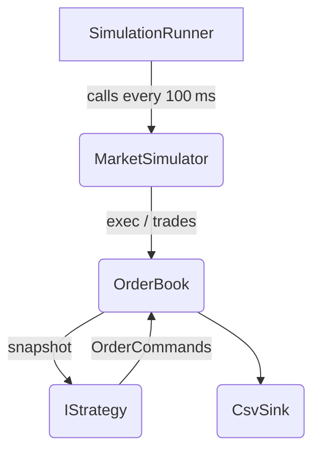

# Price‑Impact‑Simulator 🚀

_A mini HFT playground + “Momentum Ignitor” strategy for the **PUMA SE (PUM.DE)** coding
challenge._

## Contents
* [Problem statement](#problem-statement)
* [Architecture](#architecture)
* [Market simulator](#market-simulator)
* [Momentum Ignitor strategy](#momentum-ignitor-strategy)
* [Quick start](#quick-start)
* [Config](#config)
* [Outputs](#outputs)
* [Extending the project](#extending-the-project)

---

## Problem statement
Design a C# algorithm that **creates a short‑term price move** in PUM.DE while spending
as little capital as possible (limit €30 M).  
Real market impact is _not_ required – we emulate a Level‑2 order book instead.

---

## Architecture


Folder layout:

* **Domain** – immutable DTOs: `Order`, `Trade`, `ExecutionReport`, snapshots
* **Engine** – `OrderBook`, `MatchingEngine`, `MarketSimulator`
* **StrategyApi** – `IStrategy`, `OrderCommand`, `StrategyContext`
* **Host** – `SimulationRunner` (dependency‐injected loop)
* **Persistence** – plain CSV + (optionally) ScottPlot charts
* **Strategies** – sample `MomentumIgnitor.cs`
* **Tests** – xUnit coverage for book & sim invariants

---

## Market simulator
Feature | Rule
---|---
Tick‑size | **€0.01**
Clock | **100 ms** discrete ticks
Depth | Exponential \(Q = Q₀·e^{-λ·Δtick}\)
Random order size | Log‑normal _(µ = 7, σ = 1.1)_
Direction prob | $$p_{buy} = 0.5 + k_1·imb + k_2·trend - k_3·dev$$
Order types | 50 % **MARKET**, 50 % **LIMIT**
Random cancels | 0.5 % chance per resting order per tick
Liquidity refill | Auto‑top best Bid/Ask if level volume < 25 % Q₀
Snapshots | Full book dumped every **10 s** (`book_YYYYMMDD_HHMMSS.csv`)

---

## Momentum Ignitor strategy
Step | Action
---|---
1 | **Passive supports** – post two bid/ask one tick behind top; immediately cancel if they become best.
2 | **Impulse engine** – stream many tiny market buys (base 100 sh) with geometric ramp `× α` after every fill; pause if no fill for 300 ms.
3 | **Spoof assist** – post visible 10 k share bid at mid–5 ticks; pull < 2 ticks.
4 | **Exit** – when ΔP ≥ *TargetMove* **or** capital ≈ €30 M, flatten via 3 iceberg sells (slice 5 k each, peak reveal 1 k).

Configurable knobs live in ```json
{
"TargetMoveTicks": 40,
"BaseQty": 100,
"Alpha": 1.25,
"SpoofQty": 10000,
"ExitSlice": 5000
}
```

---

## Quick start
```bash
dotnet restore
dotnet run --project PriceImpactSimulator --configuration Release
```

*Logs appear in `/logs` next to the executable.*

---

## Outputs
File | Description
---|---
`orders_*.csv` | All order state transitions (_New, Trade, Cancel…_)
`trades_*.csv` | Tape of executed trades (side, price, qty)
`book_*.csv` | Full L2 snapshot every 10 s
`report.md`  | Auto‑generated run summary + PNG charts (optional)

---

## Extending the project
* Implement a new class in **Strategies** that inherits `IStrategy`.
* Register it in `Program.cs`.
* Tune simulator knobs in `appsettings.json`.

PRs welcome 🙂
