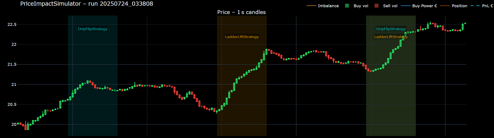
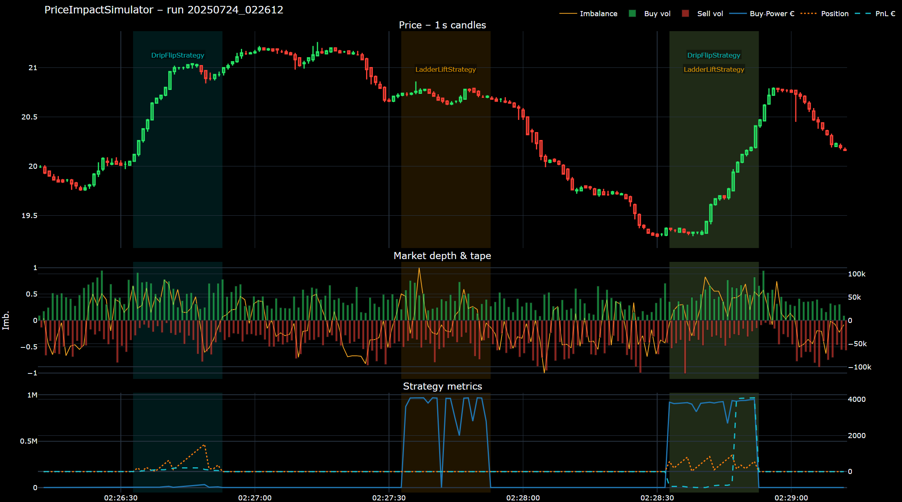
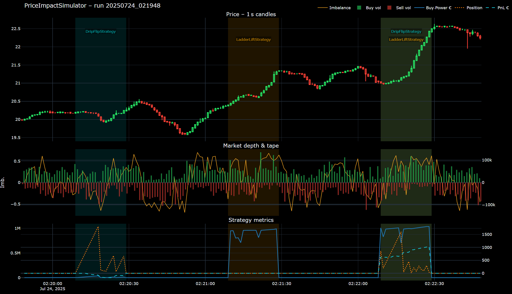
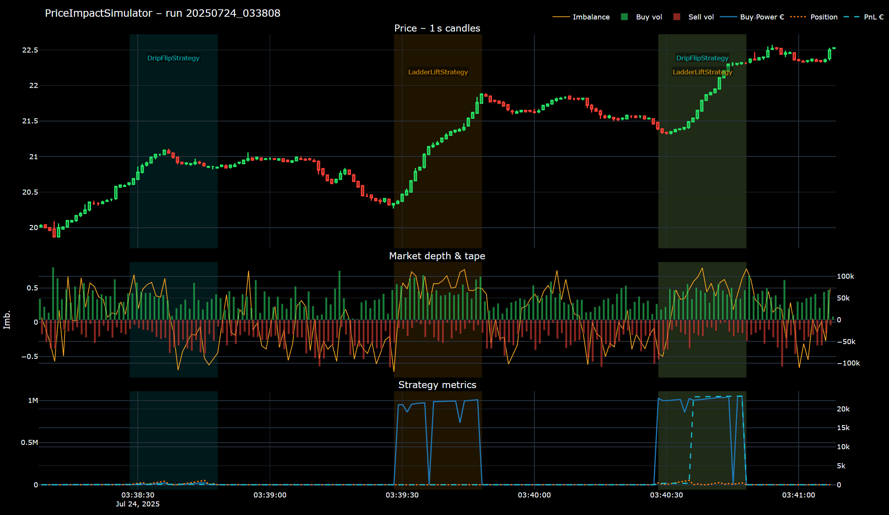

# Price‑Impact‑Oriented Trading Algorithm
*Author — Oleksandr Tarasyuk*

---

## 1 Synthetic Market

The project starts by **building the market itself**, because price impact can only be demonstrated if the venue *reacts* to our flow.

### 1.1 Three core drivers and modelling assumptions

| Driver | Formula (per 10 ms tick) | Intuition |
|--------|-------------------------|-----------|
| **Order‑book imbalance** | `imb = (∑BidQty – ∑AskQty)/(∑BidQty + ∑AskQty)` over top‑3 levels. Weight **K₁** | More bids than asks ⇒ next aggressor is more likely a buyer. |
| **Recent trade trend** | `trend = (buys – sells)/trades` over the last **N** prints. Weight **K₂** | Captures micro‑momentum in the tape. |
| **Mean reversion toward € 20.00** | `priceDev = (Mid – StartPrice)/TickSize`. Weight **K₃** | Models external arbitrage that pulls price back to its anchor. |

> **Parameter choice**  
> In production these coefficients are calibrated empirically on historical data via quantitative research.  
> Here they were *hand‑tuned* solely to visualise impact within a short demo.

Other mechanics:

* **Liquidity skeleton** – 10 × 10 grid; volume at depth *d* decays as `Q(d)=Q₀·e^(–λ·d)`.
* **Order flow** – every 10 ms the simulator issues either a limit or a market order (p ≈ 0.5). Size ∼ log‑normal(μ, σ).
* **Random cancellations** – each resting order disappears with probability *CancelProb*.

---

## 2 Strategies

| Strategy | Mechanics | Key parameters |
|----------|-----------|----------------|
| **Ladder Lift** | Places a 5‑level *buy* ladder. Any fill ⇒ cancel ladder to stay flat. | levels = 5, λ = 0.5, baseQty = 10 k |
| **Drip Flip** | Buys **1 share** at market each tick. If Bid ≥ VWAP+10 ct or ≤ VWAP−5 ct → flat via single market‑sell. | slice = 1, TP = +10 ct, SL = −5 ct |
| **Scheduler** | Activates/deactivates the above by `StrategyWindow(offset,duration)`; state changes logged in `strategy_events_*.csv`. | 3‑stage cycle (Drip → Ladder → Both) |

---

## 3 Demo runs
*(all runs share the same 3‑stage schedule, 180 s total; **max BP ≈ € 1 M**)*

| Run | RNG seed | Max ΔPrice | Impact per window |
|-----|---------:|-----------:|-------------------|
| **A** | 31 | **+1.4 %** | Drip +5 % • Ladder 0 % • Both +6 % |
| **B** | 32 | **+1.6 %** | Drip 0 % • Ladder +5 % • Both +7 % |
| **C** | 33 | **+2.2 %** | Drip +1 % • Ladder +7 % • Both +5 % |

> Different market realisations (random seeds) favour different tactics; combining both consistently beats either single leg.

### 3.1 Run A

### 3.2 Run B

### 3.3 Run C

> **Interactive dashboards** (`report_RunA.html`, `report_RunB.html`, `report_RunC.html`) are available inside each sub‑folder of **/results/**.

---

## 4 Insights

* **Layered liquidity** visibly lifts the bid stack, enticing sellers to hit higher offers.
* **Drip buying** slips inventory in quietly; the later ladder amplifies the mark‑up.
* Noticeable price moves (≈ 2 % in < 3 min) are achievable with **sub‑€ 1 M buying power** only because simulation reaction coefficients are deliberately high; in real markets the response would be far smaller and harder to detect.

---
