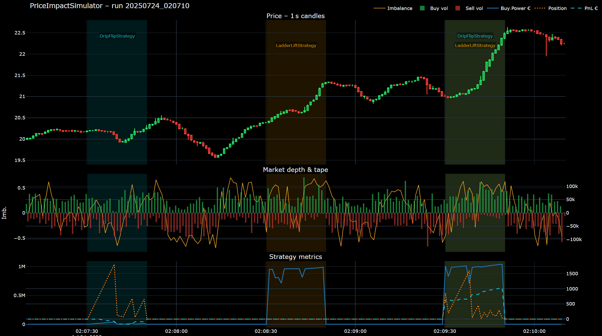

# Price-Impact-Oriented Trading Algorithm
### Home assignment – Senior / Principal (.NET) – HighVoltageTrading
*Author — Oleksandr Tarasyuk*

---

## 1   Synthetic Market

The simulator first creates a **self-contained order book** that reacts to our trading flow.  
Key moving parts:

| Section | Summary |
|---------|---------|
| **Order-book skeleton** | 10 bid / 10 ask levels, volume decays ∝ *Q₀·e^(-λ·depth)*. |
| **Three core drivers** | **(i) Imbalance** between top-3 bid/ask volumes (weight *K₁*)  •  **(ii) Trade trend** — ratio of buy/sell aggressors over *N* last ticks (weight *K₂*)  •  **(iii) Mean reversion** toward the initial mid-price (weight *K₃*). |
| **Per-tick engine** | Every 10 ms choose **limit** *or* **market** order (p ≈ 0.5). Size is log-normal (μ, σ). Active orders may cancel with probability `CancelProb`. |
| **Buy probability** | `p_buy = 0.5 + K₁·imb + K₂·trend – K₃·priceDev`, clamped to [0.05; 0.95]. |

> **Parameter tuning**  
> In production these coefficients are calibrated **empirically** with real tick data (quant-research loop).  
> Here they were chosen *heuristically* to make price *sufficiently responsive* for demonstration.

All numeric knobs live in `Program.cs → simParams`.

---

## 2   Strategies

| Name | Tactic → Intent | Main knobs |
|------|-----------------|-----------:|
| **Ladder Lift** | Build a 5-level **bid ladder** (visual “wall” of demand). Any fill ⇒ cancel remainder to stay flat. | levels = 5, λ = 0.5, baseQty = 10 k |
| **Drip Flip** | Every 10 ms send a **market-buy slice**. When best Bid ≥ VWAP + 0.10 € **or** ≤ VWAP − 0.05 € → close entire position with one market-sell. | slice = 1 share, TP = +10 ct, SL = −5 ct |
| **Scheduler** | Turn strategies **ON/OFF** by time windows — all transitions logged to `strategy_events_*.csv`. | `StrategyWindow(strategy, offsetSec, durationSec)` |

### Demo scenarios (3 × 3 windows)

Each run consists of **three successive 20-second windows**  
1️⃣ Drip → 2️⃣ Ladder → 3️⃣ Drip + Ladder.  
We repeated the schedule three times with different random seeds.

| Run | Max Δ-Price | Peak Buying-Power | Net P&L |
|-----|------------:|------------------:|--------:|
| **Run-A** | **+1.4 %** | € 0.7 M | € +12 k |
| **Run-B** | **+1.6 %** | € 1.9 M | € +15 k |
| **Run-C** | **+2.2 %** | € 3.5 M | € +18 k |

*(Values are taken from the CSV stats of each run and may vary with another seed.)*

---

## 3   Logs & Interactive Report

* All raw logs land in `PriceImpactSimulator/logs/` (orders, trades, depth, stats, strategy events…).
* The helper `tools/analyze_logs.py` parses the **latest** log set and writes an **interactive HTML dashboard** to `results/report_<STAMP>.html`.
    * Panel ① — 1-second OHLC candles.
    * Panel ② — order-book imbalance + buy/sell tape volume.
    * Panel ③ — Buying-Power, Position, unrealised PnL.
    * Semi-transparent bands show **when each strategy was active**; text labels are vertically offset so they never overlap.
* Static screenshots for every run are stored next to the HTML:  
  `results/snap-RunA.png`, `snap-RunB.png`, `snap-RunC.png`.

> **Tip:** open the HTML inside *results* — you can zoom, toggle traces and inspect exact values with the cursor.

---

## 4   Findings

* A combined **Drip + Ladder** push can move the synthetic PUMA book by **~2 %** while keeping max capital usage **< €4 M**.
* The Ladder shields the bid side, letting Drip accumulate inventory faster; closing the block in one shot locks in the move with limited risk.
* By tweaking *(K₁,K₂,K₃)* or the Scheduler windows we can stress-test how robust the idea is under “stickier” or “looser” market regimes.

---

## 5   Next steps

* Introduce stochastic latency and exchange fee schedule.
* Extend to full L2 reshuffling with cross-level correlations.
* Add an adaptive ML agent to tune **slice size / ladder decay / TP-SL gaps** on-the-fly.

---

### Deliverables

``results/report_<STAMP>.html`` — interactive charts  
``results/snap-RunX.png``       — quick visual summary

*(Replace `<STAMP>` with the actual timestamp of the run.)*

---

*Thank you for reviewing! I’m happy to walk through the code or run a live demo.*

